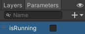

### Choosing or creating an Animator
The Unity starter asset pack includes animations that can be used with the models. It also includes some Animators including 'IdleWalk' and others in the 'Animation/More/Animators' folder including Animators for the Car models. 


To create your own animation, select the 'Animation' folder in the Project window and right-click then create a new Animation Controller. 

Click on the GameObject that will use the Animator and go to the Inspector window. Drag the Animator controller to the 'Controller' property in the 'Animator' component:


Double-click on the Animator to open it in the Animation window. Drag in the animations you want to use. Right-click on animations to add transitions for all the animation changes that you character can make. 


Go to the 'Parameters' tab.  Bool parameters allow you to change between animations by setting them to 'true' or 'false' in your code. Parameter examples include 'forward', 'crashed', 'isRunning'. To add a parameter, click on the dropdown arrow next to the '+'. Choose 'bool' and add a new Parameter.




**Tip:** Unselect 'Exit Time' on transitions to make the animation change immediately without completing. 

### Adding code to your GameObject to control the animation

Add code to a script on your GameObject to set the Parameter(s) to change the animation:

```
    Animator anim;

    // Start is called before the first frame update
    void Start()
    {
        anim = gameObject.GetComponent<Animator>();
        anim.SetBool("isRunning", false);
    }

    void Update()
    {
        if (Input.GetAxis("Vertical") > 0) // forwards
        {
            anim.SetBool("isRunning", true);
        }
        else // idle
        {
            anim.SetBool("isRunning", false);
        }

        // Code to move
    }
```


