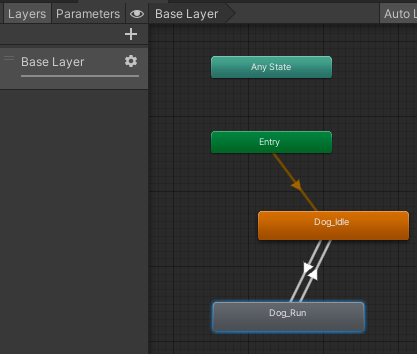
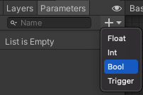

### Choisir ou créer un Animator
Le pack de ressources de démarrage Unity comprend des animations qui peuvent être utilisées avec les modèles. Il comprend également quelques Animators, notamment « IdleWalk » ainsi que d'autres dans le dossier « Animation/More/Animators », incluant des Animators pour les modèles de voiture.

Pour créer ta propre animation, sélectionne le dossier « Animation » dans la fenêtre Project et fais un clic droit puis crée un nouveau Animation Controller.

Clique sur le GameObject qui utilisera l'Animator et accède à la fenêtre Inspector. Fais glisser l'Animator Controller sur la propriété « Controller » du composant « Animator » :

Double-clique sur l'Animator pour l'ouvrir dans la fenêtre Animation. Fais glisser les animations que tu veux utiliser. Clique avec le bouton droit sur les animations pour ajouter des transitions pour tous les changements d'animation que ton personnage peut effectuer.

Va dans l'onglet « Parameters ».  Les paramètres bool te permettent de passer d'une animation à l'autre en leur attribuant la valeur « true » ou « false » dans ton code. Les exemples de paramètres incluent « forward », « crashed », « isRunning ». Pour ajouter un paramètre, clique sur la flèche déroulante à côté du « + ». Choisis « bool » et ajoute un nouveau paramètre.

Sélectionne la transition dans l'Inspector et ajoute une « Condition », et règle-la sur le paramètre `isRunning` que tu as créé sur `true` ou `false`. Dans l'exemple ci-dessous, la transition de `sit` -> `walk` est déclenchée lorsque `isRunning` est `true`.

**Astuce :** désélectionne « Exit Time » sur les transitions pour que l'animation change immédiatement sans se terminer.

### Ajouter du code à ton GameObject pour contrôler l'animation

Ajoute du code à un script sur ton GameObject pour définir le(s) paramètre(s) permettant de modifier l'animation :

--- code ---
---
language: csharp filename: follower.cs line_numbers: false line_number_start:
line_highlights:
---

    Animator anim;
    
    // Start is called before the first frame update
    void Start()
    {
        anim = gameObject.GetComponent<Animator>();
        anim.SetBool("isRunning", false); // idle
    }
    
    void Update()
    {
        if (Input.GetAxis("Vertical") > 0) // forwards
        {
            anim.SetBool("isRunning", true);
        }
        else // idle
        {
            anim.SetBool("isRunning", false);
        }
    
        // Add movement code here
    }

--- /code ---

