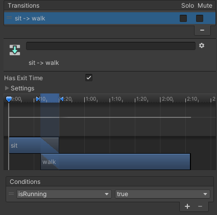

### Een Animator kiezen of maken
Het Unity-startpakket bevat animaties die met de modellen kunnen worden gebruikt. Het bevat ook een aantal Animatoren, waaronder IdleWalk, en andere in de map Animation/More/Animatoren, waaronder Animatoren voor de Car modellen.

Om je eigen animatie te maken, selecteer de 'Animation' map in het Project venster en klik met de rechtermuisknop om een nieuwe Animation Controller te maken.

Klik op het GameObject dat de Animator zal gebruiken en ga naar het Inspector-venster. Sleep de Animator-controller naar de eigenschap 'Controller' in de component 'Animator':

Dubbelklik op de Animator om deze in het Animation venster te openen. Sleep de animaties die je wilt gebruiken er naar toe. Klik met de rechtermuisknop op animations om overgangen toe te voegen voor alle animatiewijzigingen die je personage kan maken.

Ga naar het tabblad 'Parameters'.  Met Bool-parameters kun je tussen animaties wisselen door ze in je code op 'true' of 'false' in te stellen. Voorbeelden van parameters zijn 'forward', 'crashed', 'isRunning'. Om een parameter toe te voegen, klik je op de dropdown pijl naast de '+'. Kies 'bool' en voeg een nieuwe parameter toe.

Selecteer de overgang in de Inspector en voeg een 'Condition' toe. Stel deze in met de Parameter `isRunning` die je gemaakt hebt op `true` of `false`. In het onderstaande voorbeeld wordt de overgang van `sit` -> `walk` geactiveerd als `isRunning` `true` is.

**Tip:** Deselecteer 'Exit Time' bij overgangen om de animatie direct te wijzigen zonder te voltooien.

### Voeg code toe aan je GameObject om de animatie te besturen

Voeg code toe aan een script op je GameObject om de Parameter(s) in te stellen om de animatie te wijzigen:

--- code ---
---
language: csharp
filename: follower.cs
line_numbers: false
line_number_start: 
line_highlights: 
---

    Animator anim;
    
    // Start wordt aangeroepen vóór de eerste frame-update
    void Start()
    {
        anim = gameObject.GetComponent<Animator>();
        anim.SetBool("isRunning", false); // inactief
    }
    
    void Update()
    {
        if (Input.GetAxis("Vertical") > 0) // vooruit
        {
            anim.SetBool("isRunning", true);
        }
        else // inactief
        {
            anim.SetBool("isRunning", false);
        }
    
        // Voeg hier bewegingscode toe
    }

--- /code ---

